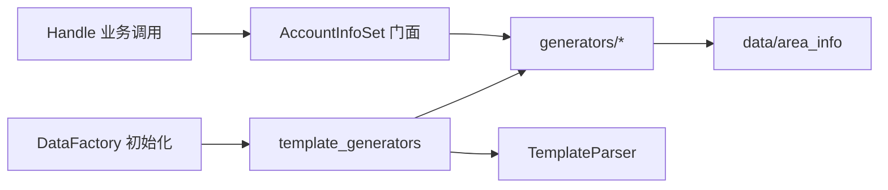

# 20260328 Selenium 自动化改造技术方案

## 1. 文档目的

本文档总结近期对 **FiccAccountSelenium** 项目在 **数据层、用例组织、随机数据模块、Pytest 基础设施** 上的改造要点，形成可执行的技术方案与架构说明，便于团队对齐与后续扩展（多数据源、多环境、CI）。

---

## 2. 改造背景与目标

| 背景 | 目标 |
|------|------|
| 测试数据散落在 Excel / YAML / 代码硬编码，缺少统一加载与缓存语义 | 引入**统一数据工厂**，支持多类型数据源、按需加载、分策略缓存 |
| `AccountInfoSet.py` 单文件过大（含海量 `AREA_INFO`），不利于维护与模板注册 | **数据与逻辑分离** + 按领域拆包 + **YAML 占位符白名单** |
| 多个用例文件重复 `LOGIN_URL`、`driver` fixture | 收敛到 **`case/conftest.py`**，基础地址从 **`base_config.yaml`** 读取 |
| Excel 用例直接 `ExcelUtil`，与 YAML 数据层风格不一致 | Excel 走 **`DataFactory.get_excel()`**，与工厂体系一致 |

---

## 3. 统一数据工厂（DataFactory）

### 3.1 核心组件

- **`util/cache_manager.py`**：`CacheEntry` + `CacheManager`，支持 TTL、按前缀清理。
- **`util/loaders/`**：`BaseLoader` + `YamlLoader` / `IniLoader` / `ExcelLoader` / `DbLoader`（预留）。
- **`util/data_factory.py`**：单例入口，方法 `get()`、`get_yaml()`、`get_ini()`、`get_excel()`、`get_db()`（需注册 DbLoader）。
- **`util/data_manager.py`**：`DataFactory` 的别名，保证旧代码 `DataManager().get_yaml(...)` 仍可用。

### 3.2 缓存策略

| 策略 | 适用 | 行为 |
|------|------|------|
| **template** | YAML 测试数据（含 `{random}`、`${func}`） | 缓存**原始** YAML；每次 `get_yaml()` 再经 `TemplateParser` 解析，保证随机值每次刷新 |
| **static** | INI、Excel | 首次加载后长期缓存，减少重复读盘 |
| **volatile** | DB（预留） | 带 TTL 缓存，过期重新查询 |

### 3.3 与模板解析的关系

- `DataFactory` 初始化时调用 **`AccountUtils.template_generators.register_template_generators()`**，向 `TemplateParser` **显式注册白名单函数**（见第 5 节），不再对整模块做 `register_module` 反射扫描。

---

## 4. 测试数据与用例分层

### 4.1 两条数据驱动路径

- **Excel 驱动**（`case/RY_UserManageTestModule.py`）：`pytest_generate_tests` 读表 → 参数化 `should_run, row_num, username, password` → `LoginTest`（登录 + 兼容路径用户管理）。
- **YAML 驱动**（`case/RY_UserManageTestModuleYmal.py`）：`get_yaml("user_manage.yaml" 等)` → `Login`（仅登录）→ `RY_UserManage_From_Dict(dict)`。

### 4.2 业务层拆分（兼容）

- **`Login(username, password)`**：仅登录，供 YAML 流程与「登录后自定义步骤」使用。
- **`LoginTest(username, password)`**：登录 + 原 `RY_UserManage()` 无参路径，**不破坏** Excel 老用例。

### 4.3 Excel 用例与工厂对齐

- `RY_UserManageTestModule.py` 中账号表通过 **`DataFactory().get_excel(RY_ACCOUNT_EXCEL_PATH)`** 读取，与 YAML 共用工厂缓存语义。

---

## 5. AccountInfoSet 模块重构

### 5.1 目录结构

- **`AccountUtils/data/area_info.py`**：仅存放 `AREA_INFO` 行政区划数据。
- **`AccountUtils/generators/`**：`id_card`、`contact`、`finance`、`tax`、`common` 分文件实现生成逻辑。
- **`AccountUtils/AccountInfoSet.py`**：**薄门面**，对外 `re-export`，保持 `from AccountUtils import AccountInfoSet` 及 `AccountInfoSet.xxx` 兼容。
- **`AccountUtils/template_generators.py`**：维护 YAML `${函数名}` **白名单**，调用 `TemplateParser.register_functions()`。

### 5.2 原则

- 移除原模块级副作用（如 import 即执行随机税号生成）。
- 模板侧仅暴露白名单内函数名，便于审计与扩展。

### 5.3 架构示意

---

## 6. Pytest 公共配置（case/conftest.py）

### 6.1 基础地址

- **`get_base_url()`**：从 `config/test_data_yaml/base_config.yaml` 的 `global_config.base_url` 读取；进程内单例缓存，避免每条用例重复解析。

### 6.2 统一 `driver` fixture

- 通过 **`request.fixturenames`** 判断是否包含 **`should_run`**：
  - Excel 参数化：`should_run=False` 时 **不启动浏览器**（Excel 加载失败占位用例）。
  - YAML 等用例：无 `should_run`，直接启动 Chrome 并打开 `get_base_url()`。

### 6.3 失败截图

- **`pytest_runtest_makereport`**：setup/call 失败且存在 `driver` 时保存 `case/screenshots/CRASH_*.png`。

---

## 7. 依赖与运行约定

- **Python 依赖**：`pyyaml`、`selenium`、`pytest`、`openpyxl` 等需在运行环境或 `requirements.txt` 中固定版本。
- **执行用例**：建议在项目根目录、激活虚拟环境后执行 `pytest case/...`；`base_url` 与业务环境一致时再跑 E2E。

---

## 8. 后续可演进方向（非本次必做）

- **DbLoader**：注入 `connection_factory` 后，测试数据可从数据库经工厂缓存读取。
- **AREA_INFO**：可进一步改为 JSON + 懒加载，继续压缩 import 路径体积。
- **RY_LoginTestModule**：若仍存在独立 `LOGIN_URL`/`driver`，可与本方案 conftest 对齐，减少重复。
- **并发执行**：使用 `pytest-xdist` 时关注进程级缓存与随机数据隔离。

---

## 9. 变更文件索引（摘要）

| 类别 | 代表路径 |
|------|----------|
| 数据工厂 | `util/data_factory.py`、`util/cache_manager.py`、`util/loaders/*`、`util/data_manager.py` |
| 模板 | `util/template_parser.py`（`register_functions`） |
| 随机数据 | `AccountUtils/AccountInfoSet.py`、`AccountUtils/data/`、`AccountUtils/generators/`、`AccountUtils/template_generators.py` |
| 用例与配置 | `case/conftest.py`、`case/RY_UserManageTestModule.py`、`case/RY_UserManageTestModuleYmal.py`、`config/test_data_yaml/base_config.yaml` |

---

## 10. 版本说明

- **文档版本**：2026-03-28  
- **适用范围**：FiccAccountSelenium 当前仓库结构；若目录或模块名变更，请同步更新本节与第 9 节索引。
