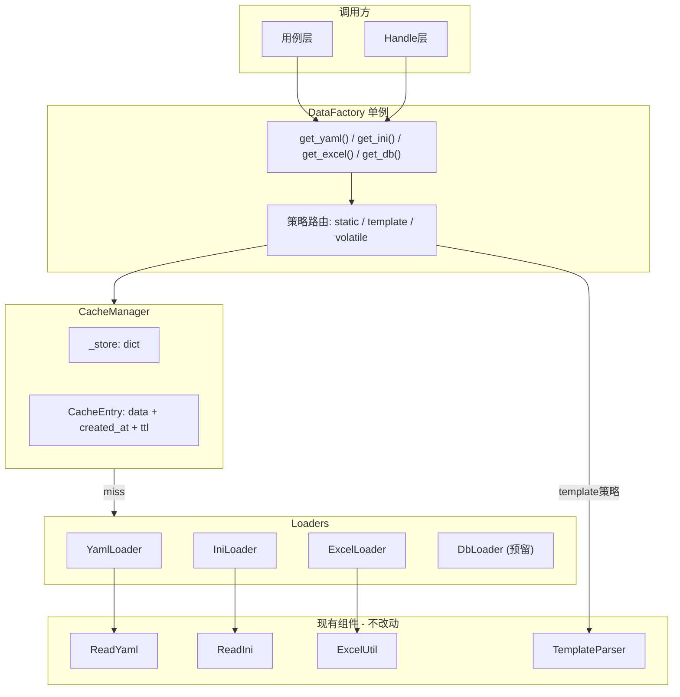

# 统一数据工厂（DataFactory）改造计划

## 现状

当前 [util/data_manager.py](util/data_manager.py) 仅封装了 YAML 的缓存加载，INI 和 Excel 各自散落在不同模块中独立调用，无统一缓存，无法扩展到数据库。

## 架构




## 缓存策略

- **static** (INI / Excel): 首次加载后永久缓存，直接返回结果
- **template** (YAML): 缓存原始模板，每次 `get()` 重新调用 `TemplateParser.parse_data()` 生成新随机值
- **volatile** (DB): 缓存带 TTL（默认 300 秒），过期自动重新查询

## 实施步骤

### 步骤 1: 新建 CacheManager

新建 [util/cache_manager.py](util/cache_manager.py)，包含：

- `CacheEntry` 类：持有 `data`, `created_at`, `ttl`，提供 `is_expired` 属性
- `CacheManager` 类：提供 `get(key)`, `set(key, data, ttl)`, `clear(prefix)`, `stats` 接口
- cache_key 规范：`{source_type}::{source_id}`，Excel 追加 sheet 索引，DB 使用 SQL 的 md5 前缀

### 步骤 2: 新建 Loader 抽象基类和具体实现

新建 [util/loaders/](util/loaders/) 目录，包含：

- `__init__.py` — 空文件
- `base_loader.py` — 定义 `BaseLoader` ABC，声明 `load()`, `cache_key()`, `source_type`, `CACHE_STRATEGY`, `CACHE_TTL`
- `yaml_loader.py` — 包装 `ReadYaml`，策略 = `template`
- `ini_loader.py` — 包装 `ReadIni`，策略 = `static`
- `excel_loader.py` — 包装 `ExcelUtil`，策略 = `static`，`cache_key` 覆写追加 sheet_index
- `db_loader.py` — 预留骨架，策略 = `volatile`，TTL = 300s，`load()` 通过 `connection_factory` 执行 SQL

每个 Loader 只做一件事：调用对应的现有读取器，返回原始数据。不修改 `ReadYaml`, `ReadIni`, `ExcelUtil` 的任何代码。

### 步骤 3: 新建 DataFactory

新建 [util/data_factory.py](util/data_factory.py)，包含：

- 单例实现（`__new`__ + `_initialized` 守卫）
- `__init`__ 中自动注册三个默认 Loader + 调用 `TemplateParser.register_module(AccountInfoSet)`
- 核心方法 `get(source_type, source_id, parse, **kwargs)`，内部按 `loader.CACHE_STRATEGY` 分三条路径处理
- 快捷方法：`get_yaml()`, `get_ini()`, `get_excel()`, `get_db()`
- 缓存管理：`clear_cache(source_type=None)`, `cache_stats` 属性

### 步骤 4: 兼容旧代码

修改 [util/data_manager.py](util/data_manager.py)，将其改为 DataFactory 的别名：

```python
from util.data_factory import DataFactory
DataManager = DataFactory
```

这样 [case/RY_UserManageTestModuleYmal.py](case/RY_UserManageTestModuleYmal.py) 中的 `DataManager().get_yaml("test_data.yaml")` 无需任何改动即可运行在新的工厂逻辑上。

### 步骤 5: 验证

- 运行 `python -c "from util.data_factory import DataFactory; f=DataFactory(); print(f.get_yaml('test_data.yaml'))"` 验证 YAML 加载 + 占位符解析
- 运行 `pytest case/RY_UserManageTestModuleYmal.py -v` 确认 YAML 用例通过
- 运行 `pytest case/RY_UserManageTestModule.py -v` 确认 Excel 老用例不受影响

## 不改动的文件

- [util/read_yaml.py](util/read_yaml.py)
- [util/read_ini.py](util/read_ini.py)
- [AccountUtils/AccountExcelUtil.py](AccountUtils/AccountExcelUtil.py)
- [util/template_parser.py](util/template_parser.py)
- [util/context_manager.py](util/context_manager.py)
- [case/RY_UserManageTestModule.py](case/RY_UserManageTestModule.py)
- [case/RY_UserManageTestModuleYmal.py](case/RY_UserManageTestModuleYmal.py)
