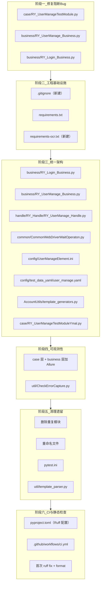

# 项目全面优化方案

## 阶段一：修复阻断 Bug（P0）

当前有两处接口断裂会导致用例运行时直接 AttributeError：

### 1.1 Excel 用例调用了不存在的方法 `LoginTest`

[case/RY_UserManageTestModule.py](case/RY_UserManageTestModule.py) 第 67 行调用 `biz.LoginTest(username, password)`，但 [business/RY_Login_Business.py](business/RY_Login_Business.py) 只有 `Login()` 方法。

- 方案：在 `RYLoginBusiness` 中将 `Login` 重命名为 `LoginTest`，或在用例中改为 `biz.Login(...)`

### 1.2 Business 层调用了不存在的 Handle 方法 `RY_UserManage`

[business/RY_UserManage_Business.py](business/RY_UserManage_Business.py) 的 `UserManageTest()` 调用 `self.UserManageBusiness.RY_UserManage()`，但 [handle/RY_Handle/RY_UserManage_Handle.py](handle/RY_Handle/RY_UserManage_Handle.py) 只有 `RY_UserManage_From_Dict()`。

- 方案：统一为 `RY_UserManage_From_Dict`，Business 层传入数据字典

---

## 阶段二：工程基础设施（P0）

### 2.1 添加根级 `.gitignore`

需排除：`__pycache__/`、`*.pyc`、`.DS_Store`、`.venv/`、`.seleniumdemo1/`、`.idea/`、`log/logs/`、`allure-results/`、`report/`、`screenshots/`、`*.egg-info/`

### 2.2 补全 `requirements.txt` 缺失依赖

当前缺少 `openpyxl`（Excel 用例必需）和 `pandas`（AccountUtils CSV 读取必需）。`webdriver-manager` 建议列为可选注释。

### 2.3 拆分依赖文件

将 OCR 相关重量级依赖（`ddddocr`、`onnxruntime`、`numpy`）拆至 `requirements-ocr.txt`，核心 `requirements.txt` 只保留自动化运行必需包。

---

## 阶段三：统一架构与分层（P1）

### 3.1 消除 Business 层无效依赖

- [business/RY_Login_Business.py](business/RY_Login_Business.py)：删除 `RYUserManageHandle` 的构造，登录 Business 只持有 `RYLoginHandle`
- [handle/RY_Handle/RY_UserManage_Handle.py](handle/RY_Handle/RY_UserManage_Handle.py)：删除未使用的 `AccountInfoSet` 导入和未使用的 `self.logger`

### 3.2 统一 YAML 用例的分层调用

当前 [case/RY_UserManageTestModuleYmal.py](case/RY_UserManageTestModuleYmal.py) 登录走 Business、用户管理却跨层直调 Handle。

- 方案：在 `RYUserManageBusiness` 中新增 `AddUser(user_data: dict)` 方法，内部调用 `RYUserManageHandle.RY_UserManage_From_Dict()`，用例统一通过 Business 层调用

### 3.3 统一超时配置注入

[common/CommonWebDriverWaitOperaton.py](common/CommonWebDriverWaitOperaton.py) 中 `timeout` 默认写死 `10`。

- 方案：`__init`__ 默认从 `Config().get_env_config()["timeout"]` 读取，保留参数覆盖能力

### 3.4 修正元素配置 key 拼写

- [config/UserManageElement.ini](config/UserManageElement.ini)：`SystenManage` -> `SystemManage`
- 同步修改 [handle/RY_Handle/RY_UserManage_Handle.py](handle/RY_Handle/RY_UserManage_Handle.py) 中的读取 key

### 3.5 修正测试数据语义

- [config/test_data_yaml/user_manage.yaml](config/test_data_yaml/user_manage.yaml)：`UserManagePassword` 的占位符从 `${RandomEmail}` 改为专用密码生成器
- 在 [AccountUtils/template_generators.py](AccountUtils/template_generators.py) 新增 `generate_random_password` 并注册

---

## 阶段四：增强可观测性（P2）

### 4.1 为用例和 Business 层添加 Allure 标注

当前所有 case 和 business 文件**零 Allure 使用**。需添加：

- case 层：`@allure.feature` / `@allure.story`
- business 层关键步骤：`with allure.step()`

涉及文件：

- [case/RY_UserManageTestModule.py](case/RY_UserManageTestModule.py)
- [case/RY_UserManageTestModuleYmal.py](case/RY_UserManageTestModuleYmal.py)
- [business/RY_Login_Business.py](business/RY_Login_Business.py)
- [business/RY_UserManage_Business.py](business/RY_UserManage_Business.py)

### 4.2 统一截图路径

[util/CheckErrorCapture.py](util/CheckErrorCapture.py) 自建 `screenshots/` 目录，与 [util/screenshot_util.py](util/screenshot_util.py) 读 `Config` 的 `screenshot.path` 不一致。

- 方案：`check_and_capture_error` 内部改为调用 `ScreenshotUtil.capture()`

---

## 阶段五：清理遗留与规范（P3）

### 5.1 删除重复模块

- [AccountUtils/pandas_excel.py](AccountUtils/pandas_excel.py) 与 [AccountUtils/AccountPandasExcel.py](AccountUtils/AccountPandasExcel.py) 高度重复，保留一个，另一个删除或 re-export
- [AccountUtils/AccountReadIni.py](AccountUtils/AccountReadIni.py) 已被 [util/read_ini.py](util/read_ini.py) 替代，确认无引用后删除

### 5.2 文件/类命名修正

- `CommonWebDriverWaitOperaton.py` -> `CommonWebDriverWaitOperation.py`（同步更新所有 import）
- `RY_UserManageTestModuleYmal.py` -> `RY_UserManageTestModuleYaml.py`（同步更新 `__pycache`__ 引用）
- `RY_UserManage_Business.py` 文件头注释从 "RY_Login_Business" 修正为 "RY_UserManage_Business"

### 5.3 放宽 pytest 收集规则

[pytest.ini](pytest.ini) 中 `python_files = *TestModule*.py` 过于严格。

- 方案：改为 `python_files = *TestModule*.py test_*.py *_test.py`，兼容标准命名

### 5.4 模板变量 `{random}` 与配置联动

[util/template_parser.py](util/template_parser.py) 中 `{random}` 写死 `randint(1000, 9999)`，与 `base_config.yaml` 的 `random_length: 4` 不联动。

- 方案：从配置读取 `random_length`，动态计算范围 `10^(n-1)` ~ `10^n - 1`

---

## 阶段六：CI 与静态检查（P1）

### 6.1 新建 Ruff 配置

在项目根新建 `pyproject.toml`，配置 Ruff 作为唯一 lint + format 工具：

- `target-version = "py311"`
- 启用规则集：`E`（pycodestyle errors）、`F`（pyflakes）、`W`（pycodestyle warnings）、`I`（isort）、`UP`（pyupgrade）、`B`（flake8-bugbear）
- `line-length = 120`（与项目现有风格匹配）
- `[tool.ruff.format]` 设置 `quote-style = "double"`
- 对现有代码中确实无法短期修正的问题，用 `per-file-ignores` 豁免（如 `AccountUtils/data/area_info.py` 大字典文件忽略 `E501`）

### 6.2 新建 GitHub Actions CI workflow

在 `.github/workflows/ci.yml` 中配置：

- 触发条件：`push` 到 `main`/`master` + 所有 `pull_request`
- Python 版本：`3.11`（与项目 tech stack 一致）
- 步骤：
  1. `actions/checkout@v4`
  2. `actions/setup-python@v5`
  3. `pip install -r requirements.txt`（核心依赖）
  4. `pip install ruff`
  5. `ruff check .` — lint 检查
  6. `ruff format --check .` — 格式检查
  7. `python -m pytest --collect-only` — 用例收集验证（不实际运行，因 CI 无浏览器）

### 6.3 首次 Ruff 修复

本地执行一次 `ruff check --fix .` 和 `ruff format .`，将自动修复的问题（import 排序、未使用 import、尾部空格等）一次性提交，确保 CI 首次即绿。

涉及新建文件：

- `pyproject.toml`
- `.github/workflows/ci.yml`

---

## 改动范围总览

