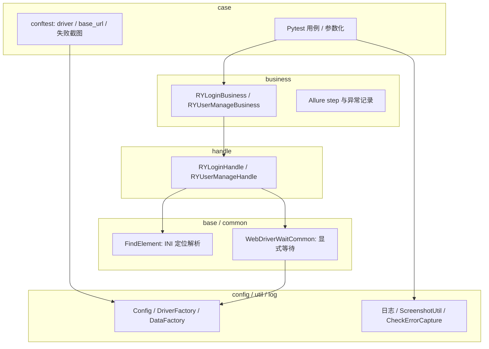

# FiccAccountSelenium 架构说明与技术方案

本文档描述项目在「分层自动化 + 统一配置与数据」修复与演进后的**整体架构**、**技术选型**与**关键设计取舍**，便于新成员 onboarding 与评审。

---

## 1. 项目定位

- **目标**：面向账户 / 用户管理类 Web 系统的 **Selenium 4 UI 自动化**。
- **用例组织**：**Pytest**（`pytest.ini` 指定 `testpaths = case`）。
- **报告**：**Allure**（`allure-pytest`；可选用 `run_tests.py --mode allure` 生成 HTML）。
- **Python 版本**：建议 **3.11+**（CI 使用 3.11；`pyproject.toml` 中 Ruff `target-version` 为 py311）。

---

## 2. 技术栈一览

| 类别 | 依赖 / 工具 | 说明 |
|------|----------------|------|
| 浏览器驱动 | Selenium 4 | 见 `util/driver_factory.py` |
| 测试框架 | pytest ≥9 | markers：`smoke` / `regression` |
| 配置 | PyYAML | `config/settings.yaml` 等 |
| 数据驱动 | openpyxl、pandas | Excel / YAML 经 `DataFactory` |
| 静态检查 | Ruff | `pyproject.toml`；CI 执行 `ruff check` / `ruff format --check` |
| 可选 | webdriver-manager | `requirements.txt` 注释；未安装时走本地路径或 Selenium 默认查找 |

核心依赖见根目录 `requirements.txt`；OCR 等重量级依赖见 `requirements-ocr.txt`。

---

## 3. 分层架构

采用 **Case → Business → Handle → Base/Common** 的职责划分：上层表达「测什么」，下层表达「页面怎么操作」，横切能力集中在 `config` / `util` / `common`。

### 3.1 Case 层（`case/`）

- **职责**：测试入口——数据准备、调用 Business、断言或失败策略；不写裸定位与重复等待逻辑。
- **基础设施**（`case/conftest.py`）：
  - **`driver`**：`DriverFactory.create_driver()`，打开 **`get_base_url()`** 对应地址；会话结束 `quit()`。
  - **Excel 参数化**：若 fixture 包含 `should_run` 且为 `False`，**不启动浏览器**（仅占位失败用例，避免 Excel 损坏时批量空跑）。
  - **`get_base_url()`**：优先 `Config().get_env_config()["base_url"]`，失败则 `DataFactory` 读 `base_config.yaml` 兜底。
  - **失败截图**：`pytest_runtest_makereport` 在 setup/call 失败时截图，受 `screenshot.on_failure` 控制。

### 3.2 Business 层（`business/`）

- **职责**：业务编排——一个类对应一块业务域（如登录、用户管理），方法名对齐用户故事（如 `LoginTest`、`Login`、`AddUser`、`UserManageTest`）。
- **约定**：用 `allure.step` 包裹步骤；捕获异常后打日志并 **re-raise**。
- **YAML 用户管理**：用例应通过 **`AddUser(user_data)`** 等 Business API，避免 Case 直接调用 Handle，保持分层一致。

### 3.3 Handle 层（`handle/RY_Handle/`）

- **职责**：单页或单流程的 UI 操作——持有 `driver`、`FindElement`、`WebDriverWaitCommon`。
- **典型方法**：`RY_Login_Register_Element`、`RY_UserManage_From_Dict`（字典驱动，与 YAML 字段名一致）。

### 3.4 Base 层（`base/find_element.py`）

- **职责**：**仅解析配置**，不执行 WebDriver 操作；从 INI 读取 `by>value` 或 XPath，带 **locator 缓存**。
- **兼容**：构造仍可传 `driver`，实为历史兼容，类已与 Driver 解耦。

### 3.5 Common 层（`common/`）

- **`WebDriverWaitCommon`**（`common/CommonWebDriverWaitOperation.py`）：统一显式等待（可见、可点击、消失等）；默认超时从 **`Config` 环境块** 的 `timeout` 注入，可构造时覆盖。
- **异常**（`common/exceptions.py`）：`ElementNotFoundError`、`ConfigError`、`BusinessError` 等，便于统一文案与扩展。

---

## 4. 横切能力与技术方案

### 4.1 统一配置（`config/settings.py`）

- **单例 `Config`**：加载 `config/settings.yaml`，支持点路径 `get("a.b.c")`。
- **Legacy 合并**：若 `settings.yaml` 中声明 `legacy.base_config_file`，会将旧 `base_config.yaml` 的 `global_config` 合并进当前环境（如补全 `base_url`、`timeout`），降低迁移成本。

### 4.2 浏览器工厂（`util/driver_factory.py`）

- 从 `Config` 读取 `browser.type`（chrome / firefox / edge）、headless、隐式等待、页加载超时、窗口大小/最大化。
- **驱动解析**：若安装 `webdriver-manager`，用其安装驱动；否则尝试配置中的本地 driver 路径或 Selenium 默认行为，并记录 warning。

### 4.3 统一数据工厂（`util/data_factory.py`）

- **单例 `DataFactory`**：注册 `YamlLoader`、`IniLoader`、`ExcelLoader`；按 Loader 的 **`CACHE_STRATEGY`**（static / template / volatile）与 `CacheManager` 缓存。
- **模板**：YAML 可经 `TemplateParser` 与 `AccountUtils.template_generators` 做占位符展开。
- **兼容**：`util/data_manager.py` 中 **`DataManager = DataFactory`**，旧代码可渐进迁移。

### 4.4 可观测性与失败现场

- **日志**：`log/user_log.py`，各层 `get_logger()`。
- **截图**：`util/screenshot_util.py`；等待失败时 `WebDriverWaitCommon` 可附带截图路径到 `ElementNotFoundError`。
- **业务错误检测**：`util/CheckErrorCapture.py` 中 **`check_and_capture_error`**——短超时检测 Element UI 错误提示，避免拖慢成功路径。

### 4.5 运行与 CI

- **`run_tests.py`**：`--mode smoke | regression | all | allure`，其余参数透传 pytest。
- **`.github/workflows/ci.yml`**：安装依赖 → Ruff lint/format 检查 → **`pytest --collect-only`**（不启动真实浏览器，验证收集与语法）。

---

## 5. 数据驱动两种形态

| 形态 | 示例入口 | 说明 |
|------|-----------|------|
| Excel 行驱动 | `case/RY_UserManageTestModule.py` | `pytest_generate_tests` 注入 `should_run, row_num, username, password`；Excel 加载失败时生成占位用例并 `pytest.fail` 说明原因 |
| YAML 场景 | `case/RY_UserManageTestModuleYaml.py` | `DataManager().get_yaml(...)`（实为 `DataFactory`），Business：`Login` + `AddUser` |

元素与账号数据分离：元素在 `config/*Element.ini`，业务数据在 `config/test_data_yaml/` 或 Excel。

---

## 6. 关键设计取舍

1. **定位与等待分离**：INI 只负责解析定位串；所有「等不等得到」集中在 `WebDriverWaitCommon`，减少 Handle 内散落裸等待。
2. **配置单一事实来源**：环境 URL、超时、浏览器行为优先走 `Config`，避免魔法数字。
3. **数据加载可扩展**：新数据源通过 `register_loader` 接入，缓存策略按类型选择。
4. **Excel 失败可观测**：加载失败仍生成可收集用例，本地与 CI 行为一致。
5. **失败证据链**：异常携带 locator/截图路径 + conftest 失败截图 + 可选业务错误弹窗检测。

---

## 7. 相关路径速查

| 用途 | 路径 |
|------|------|
| Pytest 配置 | `pytest.ini` |
| Case 级 fixture / hook | `case/conftest.py` |
| 统一配置类 | `config/settings.py` |
| Driver 创建 | `util/driver_factory.py` |
| 数据统一入口 | `util/data_factory.py` |
| 多模式跑用例 | `run_tests.py` |
| Ruff 配置 | `pyproject.toml` |
| CI | `.github/workflows/ci.yml` |

---

## 8. 文档维护

当发生以下变更时，建议同步更新本文档：新增分层约定、更换配置格式、调整 CI 门禁、或数据工厂缓存策略变更。
